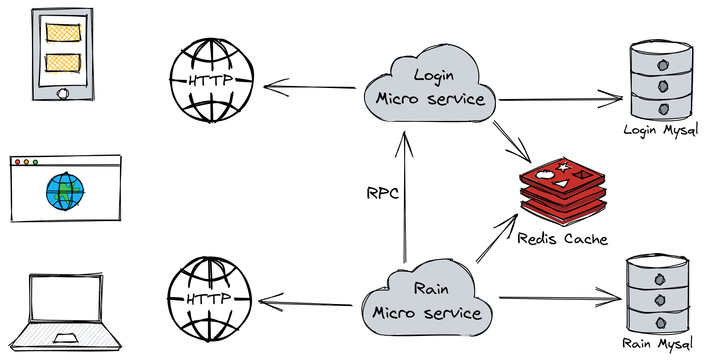
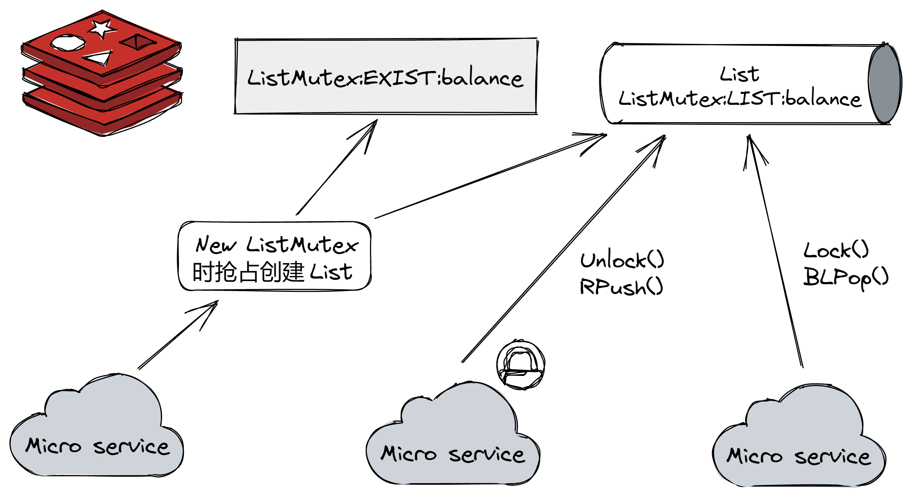

# Go微服务红包雨

## 项目提出 

假设新春佳节，我们要搞一场营销活动，向软件的众多用户派发红包。

每名用户有10次开红包的机会，每个红包的金额从0到10元不等。

现在我们需要设计一个能承接高并发的红包雨系统，让用户有良好的活动体验，同时必须保证系统的开支金额与用户的红包金额一致。

## 设计

基于 `go-zero` 搭建微服务框架，采用 `redis` 作为缓存。

共有2个微服务，一个负责维护用户基本信息（账号、姓名、密码等），对外提供api，对内提供rpc。

另一个是活动专用微服务，维护用户的活动信息（账号、封禁状态、余额、剩余次数等），对外提供api。



这是一种读少写多的场景。

用户活动数据的缓存一致的策略是先更新数据库，后删除缓存方案。

系统余额一直放入redis中，并用[自己编写的分布式锁](https://github.com/BacklitCat/go-redis-distributed-lock)保证扣减库存一致。

我写过两个分布式锁，这次采用[队列锁](https://github.com/BacklitCat/go-redis-distributed-lock/blob/main/lock/listmutex.go)，应该也适用于秒杀场景。



## 并发测试

1名用户首先请求登录，拿到token后，在活动页面查看状态，如果有剩余次数，则每隔4s打开一次红包（后端限制最快3s请求一次），直到无次数为止。在过程中如果token超时（在测试时其实不会）则重新登陆。

```go
func (u *User) work() {
	_ = u.login()
	_ = u.check()
	for u.remaining > 0 {
		time.Sleep(4 * time.Second)
		_ = u.open()
	}
}
```

总共有2000名用户参加测试。


```
模拟完成，共有2000位用户参与模拟，
共获得：113629，
系统余额：9999886371，
系统开支：113629
```
可以看到，由于使用了并发锁控制，保证了扣减库存一致。

测试过程中，CPU遇到瓶颈。由于一台机器既要作为Client发起大量请求，又要作为Server处理大量请求，频繁的创建和销毁协程引起了cpu的瓶颈，如果分开运行并发量会更高。